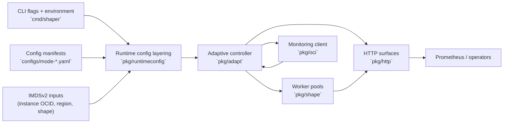

# OCI CPU Shaper Overview

The OCI CPU Shaper project provides tools for shaping and orchestrating CPU resource usage across Oracle Cloud Infrastructure workloads. The overarching goal is to offer adaptive scheduling, telemetry integration, and policy-driven controls that help teams right-size compute consumption while maintaining service quality.

This overview summarizes the high-level vision and map to the supporting documentation set:
Operators looking for the fastest onboarding path should start with the [§10 Quick Start Onboarding guide](./10-quick-start.md), which condenses the plan-mandated console tasks before diving into the deeper references below.

## §0 Architecture Diagram

## §0.1 Interface Jump Table

| Interface | Purpose | Detailed guidance |
| --- | --- | --- |
| **IMDSv2** | Supplies compartment, region, and instance OCIDs so the adaptive controller can authenticate Monitoring clients even when configs rely on instance principals. | [§2 IMDS Integration](./02-imds-v2.md) |
| **OCI Monitoring (MQL)** | Streams tenancy metrics (e.g., `CpuUtilization`) into the controller’s suppression logic and alarms to sustain Always Free guardrails. | [§5 Monitoring & Alerts](./05-monitoring-mql.md) |
| **Prometheus surfaces** | Exposes `/metrics` and `/healthz` for fleet monitoring and debugging, mirroring the CLI toggles and HTTP config described in §9. | [§9 CLI Reference](./09-cli.md) |

## §0.2 Runtime configuration pipeline

Controller wiring follows the layered configuration path defined in the implementation plan (§§3.1, 5.2) and detailed in [`docs/05-execution-flow.txt`](./05-execution-flow.txt):

1. **CLI flags** set bootstrap defaults for the config path, log level, run mode, and optional shutdown timer without requiring YAML upfront.
2. **YAML manifests** such as [`configs/mode-a.yaml`](../configs/mode-a.yaml) and [`configs/mode-b.yaml`](../configs/mode-b.yaml) load next to supply controller targets, estimator cadence, worker sizing, HTTP binding, and OCI tenancy inputs.
3. **Environment overrides** (`SHAPER_*` variables) merge on top so operators can reuse the shipped manifests while tuning Always Free guardrails in CI or incident response.
4. **Validation and translation** in [`pkg/runtimeconfig`](../pkg/runtimeconfig) enforce bounds before emitting controller-ready structs consumed by [`pkg/adapt`](../pkg/adapt) and the CLI factories.

The same pipeline powers the container entrypoint and the CLI so downstream binaries can share the configuration API without re-implementing loaders. See [§9 CLI Reference](./09-cli.md) for the full flag and environment matrix.

## §0.3 Controller layers and metrics surfaces

- **Runtime layers** – [`cmd/shaper`](../cmd/shaper) builds the adaptive controller using the translated config, injects the Monitoring client, and installs the worker pool. [`pkg/adapt`](../pkg/adapt) owns suppression logic, estimator inputs, and mode handling, while [`pkg/shape`](../pkg/shape) manages the duty-cycle worker threads.
- **Metrics surfaces** – [`pkg/http`](../pkg/http) exposes `/metrics` (Prometheus) plus `/healthz` status JSON, and [`cmd/shaper`](../cmd/shaper/metrics_handlers.go) wires controller state, cgroup readings, and OCI error strings into those endpoints. `docker compose` and Quadlet bundles bind the listener to `:9108` by default; operators can disable the HTTP listener with `HTTP_ADDR=` when smoke testing.
- **Telemetry loop** – [`pkg/oci`](../pkg/oci) streams `CpuUtilization` samples into the controller so suppression and target tracking stay aligned with the Always Free reclaim guardrails, while the `/metrics` export mirrors loop cadence and last-error details for fleet observability.

- **Threat Model** – Baseline trust boundaries, IAM scope, and exposed surfaces. See [§1 Threat Model](#%C2%A71-threat-model).
- **Non-goals** – Out-of-scope behaviors so operators can quickly identify unsupported asks. See [§2 Non-goals](#%C2%A72-non-goals).
- **Quick Start (§10)** – Five required deployment moves, from Monitoring enablement through alarm wiring. See [§10 Quick Start Onboarding](./10-quick-start.md).
- **IAM and Policies** – Configure dynamic groups and Monitoring permissions so instance principals can query tenancy metrics. See [`01-oci-policy.md`](./01-oci-policy.md).
- **IMDS Integration** – Understand metadata resolution, retry policies, and offline fallbacks. See [`02-imds-v2.md`](./02-imds-v2.md).
- **Always Free Guardrails** – Track Oracle’s reclaim thresholds and remediation playbooks. See [`03-free-tier-reclaim.md`](./03-free-tier-reclaim.md).
- **CPU Control Surfaces** – Tune cgroup v2 weights and optional ceilings exposed by container runtimes and Quadlet. See [`04-cgroups-v2.md`](./04-cgroups-v2.md).
- **Monitoring & Alerts** – Issue tenant-signed MQL requests and wire alarms that mirror reclaim detection. See [`05-monitoring-mql.md`](./05-monitoring-mql.md) and [`07-alarms.md`](./07-alarms.md).
- **Deployment Patterns** – Compose, Quadlet, and Terraform references that ship Mode A/Mode B defaults. See [`06-komodo-compose.md`](./06-komodo-compose.md).
- **Contributor Reference** – Tooling workflows, coverage expectations, and CI guardrails for extending `cmd/`, `pkg/`, and `internal/`. See [`08-development.md`](./08-development.md) and [`14-ci-pr-workflow-review.md`](./14-ci-pr-workflow-review.md).
- **CLI Reference** – Detailed flag descriptions, configuration layering, and diagnostics. See [`09-cli.md`](./09-cli.md).

## §1 Threat Model

The controller operates with the minimal privileges outlined in the implementation plan and only exposes the surfaces documented elsewhere in `docs/`. Threat considerations include:

- **Instance principal scope** – IAM access is constrained to the `read metrics` permission described in [`01-oci-policy.md`](./01-oci-policy.md). No tenancy writes or network control APIs are invoked, so a compromised shaper can only read historical Monitoring data.
- **Metadata handling** – IMDSv2 is the sole source of instance identifiers, compartment OCIDs, and region hints. Requests are bound to the local link endpoint, require short-lived session tokens, and never persist the bearer secrets to disk, limiting exposure to host-local actors.
- **Controller surfaces** – The binary runs rootless by default (Mode A) with an optional rootful Mode B that only adds `CAP_SYS_NICE` for `SCHED_IDLE`. No other Linux capabilities are requested, and the Prometheus `/metrics` plus `/healthz` handlers are read-only to keep the HTTP listener from becoming a mutation vector.
- **Offline fallback** – When `oci.offline` is set or Monitoring queries fail, the controller swaps in a static estimator without pulling extra credentials, preserving the same IAM blast radius while still meeting the Always Free duty-cycle goals documented in §§3 and 5.

## §2 Non-goals

To keep the threat model tractable and the operational scope focused, the following behaviors remain explicitly out of scope:

- **Acting as an access-control boundary** – The shaper assumes the host administrator controls the container runtime. If an attacker gains root on the host, they can tamper with cgroup weights or the binary regardless of the shaper’s own posture.
- **Managing OCI resources** – The project will not auto-provision Dynamic Groups, policies, alarms, or metrics plugins. Operators must follow §§1, 5, 7, and 10 to configure those prerequisites using the console, Terraform, or CLI workflows outside of the shaper’s runtime.
- **Serving as a general-purpose load generator** – Worker pools are tuned solely to maintain the 7-day P95 guardrail. Scenarios such as stress testing, benchmarking, or non-OCI deployments require bespoke tooling.
- **Broad telemetry ingestion** – Beyond IMDSv2, `/proc/stat`, and OCI Monitoring, no additional metadata, tracing, or logging integrations are in scope. This avoids importing secrets or tokens from other services that could complicate the threat model.

## §5 Configuration and CLI Surfaces

Command-line tooling provides the first entry point for operators. The `shaper` binary exposes four bootstrap flags that align with §§3.1 and 5.2 of the implementation plan:

- `--config` – Absolute or relative path to the primary YAML manifest. Defaults to `/etc/oci-cpu-shaper/config.yaml`.
- `--log-level` – Structured logging level recognised by the Zap logger (`debug`, `info`, `warn`, `error`, `dpanic`, `panic`, `fatal`).
- `--mode` – Controller behaviour selector. `noop` skips controller wiring for diagnostics, while `dry-run` and `enforce` start the adaptive controller with live OCI metrics when available.
- `--shutdown-after` – Optional duration that cancels the process context after the requested window so smoke tests and diagnostics can exit cleanly.

The CLI also provides `--version` and the equivalent `version` subcommand for fast build metadata checks that avoid configuration loading.

Configuration manifests keep policy inputs and infrastructure wiring distinct. Top-level sections include:

- `controller.*` – Slow-loop targets, relaxed intervals, and suppression thresholds that align with the Always Free reclaim guardrails.
- `estimator.*` – Fast `/proc/stat` sampling cadence that feeds host-load suppression.
- `pool.*` – Worker count and duty-cycle quantum sizing for the CPU load generator.
- `http.*` – Prometheus exporter bind address surfaced at `/metrics`.
- `oci.*` – Compartment OCID, region, optional instance OCID override, and offline toggle used to wire Monitoring clients or static fallbacks.

Environment variables override the YAML manifest so operators can ship the published `configs/mode-a.yaml` and `configs/mode-b.yaml` defaults and apply targeted adjustments for experiments or incident response. The complete CLI and configuration reference lives in [`09-cli.md`](./09-cli.md) and links directly to the §10 Quick Start onboarding steps for deployment context.

Additional documents will be added to detail interfaces, deployment flows, and best practices as the project evolves. For local development environment setup and contributor tooling expectations, see [`08-development.md`](./08-development.md).
